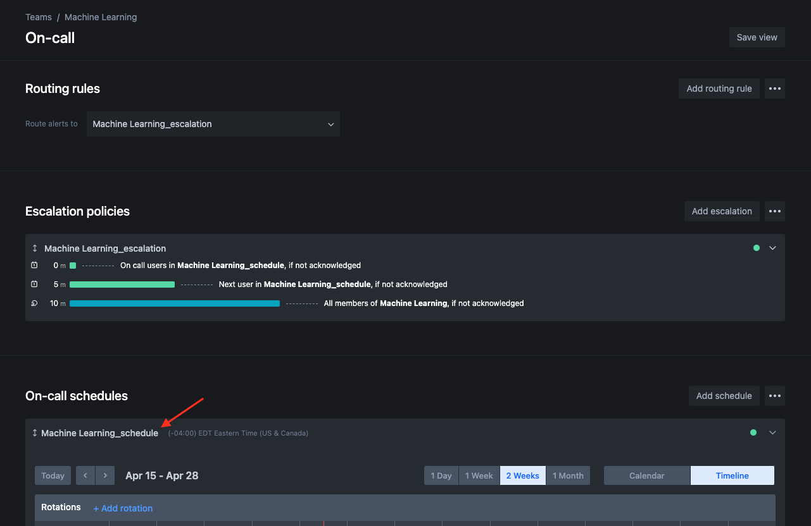

# SlackGenie

Sync Opsgenie Schedule participants to Slack Usergroups.

Installation:
```
go install github.com/orthly/slackgenie@latest
```

Usage:

```
❯ slackgenie --help
Usage of slackgenie:
  -opsgenie-api-key string
    	Opsgenie API Key. Will be read from environment 'OPSGENIE_API_KEY'
  -opsgenie-schedule string
    	Opsgenie Team Schedule Name
  -slack-api-key string
    	slack API Key. Will be read from environment 'SLACK_API_KEY'
  -slack-group string
    	Slack Usergroup handle without @
```

Example: To sync opsgenie schedule "Machine Learning_schedule" to Slack usergroup "@ml-oncall". (export `OPSGENIE_API_KEY` and `SLACK_API_KEY`):
```
slackgenie -opsgenie-schedule "Machine Learning_schedule" -slack-group ml-oncall
```

## Finding the Team Schedule Name

It is under "On-call schedules" in the Opsgenie Team's page:


